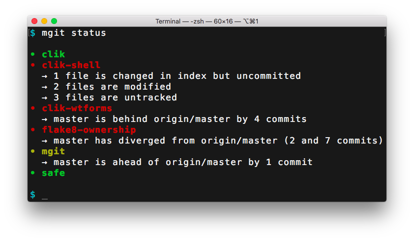
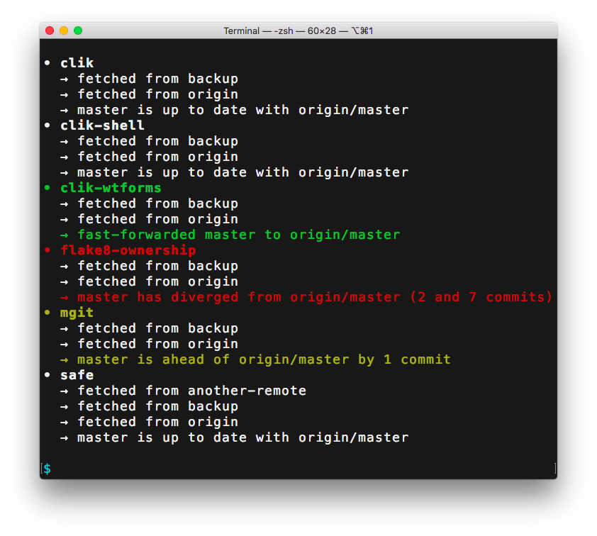

# mgit

## Table of Contents

* [Quickstart](#quickstart)
  * [Install](#install)
  * [Configure](#configure)
  * [Screenshots](#screenshots)
* [Manual](#manual)
  * [Configuration Files](#configuration-files)
  * [Settings](#settings)
  * [Tags](#tags)
  * [Warnings](#warnings)
  * [Commands](#commands)
    * [Config](#config)
    * [Status](#status)
    * [Pull](#pull)


## Quickstart

mgit is a small command-line application for developers who work with
many git repositories, many remotes, and many branches. The `mgit
status` command shows, for each of your repositories, whether there
are any untracked or uncommitted changes, or any tracking branches
that are ahead, behind, or diverged from their upstreams. `mgit pull`
fetches from all configured remotes, then tries to fast-forward all
tracking branches whose upstream branch has changed. (If it's not a
simple fast-forward, mgit does nothing.)

### Install

mgit is supported only on Unix-like systems and is targeted
specifically at Linux and macOS.

Requires:

* Rust/Cargo
* libgit2 + headers
* newer openssl + headers
* libssh2 + headers
* other stuff?

```sh
git clone https://github.com/decafjoe/mgit.git
cd mgit
cargo build --release
# Copy target/release/mgit to somewhere on your $PATH
# or add target/release to your $PATH
```

### Configure

Create a directory, `~/.mgit/`, then create a file in that directory
named `example.conf`. (The filename doesn't actually matter as long as
it's in `~/mgit/` and ends in `.conf`.)

The config file format is INI, with section names being paths to repos
on your system. For example:

```ini
[~/clik]
[~/clik-shell]
[~/clik-wtforms]
[~/flake8-ownership]
[~/mgit]
[~/safe]
```

### Screenshots

`mgit status`:



`mgit pull`:


That last screen from `mgit pull`:



Run `mgit -h` or `mgit --help` for a list of commands and arguments:

```
mgit 0.4.0
Small program for managing multiple git repositories.

USAGE:
    mgit [OPTIONS] [SUBCOMMAND]

FLAGS:
    -h, --help       Prints help information
    -V, --version    Prints version information

OPTIONS:
    -c, --config <PATH>...    Path to configuration file or directory [default:
                              ~/.mgit]
    -W, --warning <ACTION>    Action to take on warnings [default: print]
                              [possible values: ignore, print, fatal]

SUBCOMMANDS:
    config    Prints configuration as interpreted by mgit
    help      Prints this message or the help of the given subcommand(s)
    pull      Fetches from remotes and fast-forwards local tracking branches
              if safe
    status    Prints current status of repositories
```


## Manual

### Configuration Files

The configuration file format is INI. Sections specify the paths to
repositories and the (optional) settings specify the configuration for
the repo.

By default mgit expects its configuration to be in a directory at
`~/.mgit/`. mgit looks inside this directory (recursively) for files
with a `.conf` extension and reads those files into the configuration.

You can specify a different configuration directory or file with the
`-c/--config` argument. `-c/--config` may be specified multiple times:

```sh
mgit -c ~/some/path --config /some/other/path <SUBCOMMAND AND ARGS>
```

If the path is a directory, it is walked recursively and any files
ending in `.conf` are read into the configuration. If the path is a
file, it is read into the configuration regardless of its extension.

Absolute, relative, and "homedir-style" (`~/` or `~username/`) paths
are supported. Absolute paths are left untouched. Homedir-style paths
are expanded out to the appropriate absolute path.

When supplied to `-c/--config`, relative paths are relative to the
current working directory.

When used in configuration files, relative paths are *relative to the
configuration file*. So, for example, a configuration file at
`~/.mgit/my/stuff.conf` that contained `[../../myrepo]` would resolve
to `~/myrepo` regardless of the current working directory.


### Settings

Repositories have a few optional settings: `symbol`, `name`, and
`tags`.

`symbol` and `name` control how the repository is displayed by `mgit
status` and `mgit pull`'s summary:

```
<symbol> <name>
  ... <information> ...
<symbol> <name>
  ... <information> ...
```

`symbol` defaults to `•`, but can be changed in the configuration
file:

```ini
[~/path/to/some-project]
[~/other/path/other-project]
symbol = ▶
```

`name` defaults to the last part of the repository's path and can also
be changed in the configuration file:

```ini
[~/path/to/some-project]
name = first-project
[~/other/path/other-project]
name = second-project
```

This is helpful when you have multiple repos with identical names:

```ini
[~/notes]
name = notes/personal
[~/work/notes]
name = notes/work
```

Or when you don't have control over where the repo is checked out:

```ini
[~/.emacs.d]
name = emacs
```

### Tags

Tags allow operations to be limited/grouped/scoped to certain
repositories. All mgit subcommands take a `-t/--tag` argument, which
may be specified multiple times.

The `config` and `status` subcommands limit and group their output
based on the `-t/--tag` argument(s), when specified.

When `-t/--tag` is supplied to `pull`, it makes a list of all repos
with the given tag(s), *only* fetches from remotes related to those
repos, *only* fast-forwards tracking branches in those repos, then
reports the summary information grouped by the specified tags.

In the configuration, tags are a simple space-separated list of
strings:

```ini
[~/path/to/some-project]
tags = personal rust
[~/path/to/another-project]
tags = personal python
[~/other/path/other-project]
tags = work rust
[~/notes]
name = notes/personal
tags = personal org
[~/work/notes]
name = notes/work
tags = work org
```

### Warnings

mgit warns when:

* a config file/directory can't be read
* a config file can't be parsed as ini
* a repo path does not exist
* a repo path can't be opened
* a repo path isn't a git repo
* a repo is already in the configuration

Example, where the configuration contains `[~/does/not/exist]`:


If there are no repositories configured, mgit considers this a fatal
error and will stop program execution before subcommands run:


You can silence warnings using the `-W` argument:


Alternatively, you can turn warnings into fatal errors:


By default, `-W/--warning` is `print`.

### Commands

#### `config`

The `mgit config` command shows you how mgit is interpreting the
configuration:


By default, `config` only shows values you have explicitly set. To see
all values, including defaults assigned by mgit, run `mgit config -v`:


`mgit config` also accepts one or more `-t/--tag` arguments, in which
case the output is limited and grouped by the specified tag(s):


Note that `config` output is sorted by repo path (as specified in the
configuration, *not* as resolved).

#### `status`

`mgit status` tells you which worktrees are dirty and which tracking
branches are ahead/behind/diverged from their upstreams:


By default, `status` elides information about repositories when
there's nothing "interesting" about them. To see the full status
information, supply the `-v/--verbose` argument to mgit status:


`mgit status` takes the `-t/--tag` argument. If supplied, the output
will be limited to and grouped by the specified tag(s):


#### `pull`

In pseudocode, `mgit pull` does the following:

```
for repo in <repos to fetch based on -t/--tags>:
  for remote in repo.remotes():
    fetch_from_remote()
    for tracking_branch in repo.tracking_branches():
      if <tracking_branch upstream is from remote>:
        // see below
```

For each tracking branch:

* If the local branch and upstream branch point to the same commit,
  mgit does nothing.
* If the local branch is ahead of the upstream branch, mgit does
  nothing.
* If the local branch and upstream branch have diverged, mgit does
  nothing.
* If the local branch is HEAD and the worktree is anything but
  pristine (i.e. if there is anything in the index, or any modified or
  untracked files), mgit does nothing.
* If the local branch is behind upstream and a simple fast-forward
  would bring it up to date, mgit fast-forwards the local branch
  reference.
  
In other words: `mgit pull` tries to avoid doing stupid or dangerous
things. The only changes that are made are (1) fetching from remotes
and (2) simple fast-forwards. Otherwise mgit leaves your repos alone.

`mgit pull` in action:


That last screen as a static screenshot:


During fetch, mgit shows the status of each repository/remote using a
color code. For repositories:

* White – no changes have been made, all tracking branches so far have
  been up to date
* Green – at least one tracking branch was fast-forwarded to its
  upstream
* Yellow – at least one tracking branch is ahead of its upstream
* Red
  * Fetch failed, or
  * At least one tracking branch has diverged from its upstream, or
  * A tracking branch was HEAD, was behind its upstream, but could not
    be fast-forwarded due to a dirty worktree
  
For remotes, the color codes above mean the same thing, except
"tracking branches" means "tracking branches whose upstream branch is
on this remote." There are two additional color codes for remotes:

* Blue – the fetch has not yet been started
* Cyan – the fetch is in progress

`mgit pull` accepts one or more `-t/--tag` arguments, which limits the
fetch/pull operations to the repositorties with the specified tags.
  
By default, mgit will do eight concurrent fetches. You can override
this by specifying the `-c/--concurrent` argument to `pull`:

```sh
mgit pull -c 16
```

TODO(jjoyce): document `-v/--verbose` once issue #7 is closed.
