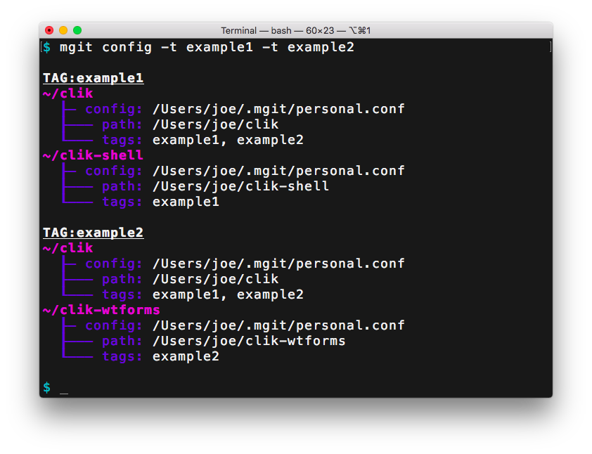
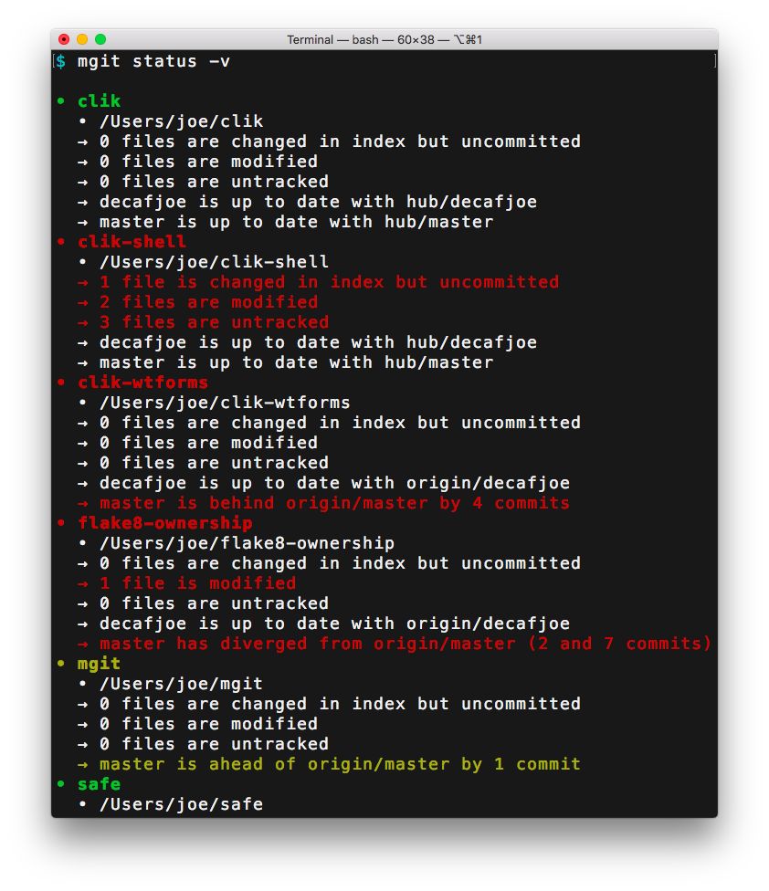

# mgit

## Table of Contents

* [Intro](#intro)
* [Installation](#installation)
* [Configuration](#configuration)
  * [Tags](#tags)
  * [Checks](#checks)
* [Usage](#usage)
  * [Help](#help)
  * [Config](#config)
  * [Warnings](#warnings)
  * [Status](#status)
  * [Pull](#pull)


## Intro

mgit is a command-line application for managing multiple git
repositories.

**Big, honking note.** This is my first foray into Rust. There is a
high probability the code is garbage. But if you clone this repo and
run `cargo build` you should end up with an executable that does what
it says on the tin.

mgit was built to help bring sanity to working with tens of git
repositories. Every day I touch zero to ~20 repositories. Not all of
those touches are neat, linear, committable chunks that I'm ready to
push upstream. So at the end of the day there is an unknown number of
changed repositories and an unknown number of changes within those.

Enter `mgit status`:


`mgit status` tells you which worktrees are dirty and which tracking
branches are ahead/behind/diverged from their upstreams.

mgit's other command, `mgit pull`, brings sanity to the process of
pulling changes from remotes. For each repo, it fetches from all
configured remotes. Note: this is a *fetch*, not a *pull*. If the
fetch succeeds, mgit looks at each tracking branch.

* If the local branch is ahead of the upstream branch, mgit does
  nothing.
* If the local branch and upstream branch have diverged, mgit does
  nothing.
* If the local branch is HEAD and the worktree is anything but
  pristine (i.e. if there is anything in the index, or any modified or
  untracked files), mgit does nothing.
* If the local branch is behind upstream and a simple fast-forward
  would bring it up to date, mgit fast-forwards the local branch
  reference.
  
In other words: `mgit pull` tries to avoid doing stupid or dangerous
things. The only changes that are made are (1) fetching from remotes
and (2) simple fast-forwards. Otherwise mgit leaves your repos alone.

## Installation

Requires:

* Rust and cargo
* libssh2 + headers
* other stuff?

```sh
git clone https://github.com/decafjoe/mgit.git
cd mgit
cargo build --release
# Copy target/release/mgit to somewhere on your $PATH
```


## Configuration

Configuration files are in the ini format. Section names specify paths
to repositories, and the (optional) settings specify the configuration
for the repo. A minimal configuration file might look something like
this:

```ini
[~/.emacs.d]
[~/clik]
[~/mgit]
# ...
```

By default mgit expects there to be a directory at `~/.mgit`. mgit
looks inside this directory (recursively) for files with a `.conf`
extension and reads those files into the configuration. You can change
the configuration path from `~/.mgit` using the `-c/--config` argument
to mgit (see *Usage* below).

Absolute, relative, and "homedir-style" (`~/` or `~username/`) paths
are supported. Absolute paths are left untouched. Homedir-style paths
are expanded out to the appropriate absolute path. Relative paths are
*relative to the configuration file*. So a configuration file at
`~/.mgit/my/thing.conf` that contained `[../../mgit]` would point to
`~/mgit`.

The "label" mgit uses for `status` and `pull` is composed of a symbol
and a name:

```
• .emacs.d
• clik
• mgit
```

By default, the symbol is `•` and the label is the last component of
the repo path. These can both be changed in the repo settings in the
configuration:

```ini
[~/.emacs.d]
name = emacs.d
symbol = ⊃
# ...
```

Now mgit labels the emacs repo as follows. Note that the sort order
changes as well. mgit always sorts things by repo name. (The only
exception is the `config` subcommand.)

```
• clik
⊃ emacs.d
• mgit
```

To see how mgit is interpreting the configuration, use the `mgit
config` command. The output looks something like this:


By default, `config` doesn't show config values you haven't set. To
see *everything*, run `mgit config -v`:


Note that `config` output is sorted by repo path (as specified in the
configuration, *not* as resolved).

### Tags

You may have noticed the `tags: <not set>` lines in the verbose output
above.

Tags allow operations to be limited/grouped/scoped to certain
repositories. All mgit subcommands take a `-t/--tag` argument, which
may be specified multiple times.

The `config` and `status` subcommands limit and group their output
based on the `-t/--tag` argument(s), when specified.

When `-t/--tag` is supplied to `pull`, it makes a list of all repos
with the given tag(s), *only* fetches from remotes related to those
repos, *only* fast-forwards tracking branches in those repos, then
reports the summary information grouped by the specified tags.

In the configuration, tags are a simple space-separated list of
strings:

```ini
[~/.emacs.d]
name = emacs.d
symbol = ⊃
tags = private
[~/clik]
tags = public python
[~/mgit]
tags = public rust
```

Now the config command looks like this:




### Checks

mgit is picky about its configuration.

* If a config file/directory can't be read, it will complain
* If a config file isn't a valid ini, it will complain
* If a repo path does not exist, it will complain
* If a repo path can't be opened, it will complain
* If a repo path isn't a git repo, it will complain
* If a repo is already in the configuration, it will complain

For all cases, "it will complain" means mgit will register a warning
(see *Usage* below) and will not add the repo to the configuration.

If there are no repositories configured, mgit considers this a fatal
error and will stop program execution before subcommands run.


## Usage


### Help

Supply the `-h/--help` argument to mgit or any of its subcommands to
get usage information. You can also use the `help` subcommand to get
help for other subcommands.


### Config

By default, mgit looks at `~/.mgit` for its configuration. You can
override that with the `-c/--config` argument, which can be specified
multiple times:

```sh
mgit -c ~/some/path --config /some/other/path <SUBCOMMAND AND ARGS>
```

If the path is a directory, it is walked recursively and any files
ending in `.conf` are read into the configuration. If the path is a
file, it is read into the configuration regardless of its extension.


### Warnings

As mentioned in *Checks* above, mgit is picky about its configuration
and will output warnings if anything seems remotely "off." You can
silence the warnings using the `-W` argument:

```sh
mgit -W ignore <SUBCOMMAND AND ARGS>
```

Alternatively, you can turn warnings into fatal errors:

```sh
mgit -W fatal <SUBCOMMAND AND ARGS>
```

By default, `-W/--warning` is `print`.


### Status

By default, `status` elides information about repositories that do not
require action. To see the full status information, supply the
`-v/--verbose` argument to mgit status:



Note that the status command takes the `-t/--tag` argument. If
supplied, the output will be limited to and grouped by the specified
tag(s).


### Pull

**Note: there is no way to kill mgit (except from outside the process)
while it is fetching. This really sucks, and I apologize, and I
promise that it's a priority. See issue #5.**

As mentioned in *Configuration* above, `pull` makes a list of repos
for which to fetch remotes based on the `-t/--tag` argument(s)
supplied. With no arguments, the list includes all repos. Otherwise,
the list is comprised of repos with the specified tag(s).

During fetch, mgit shows the status of each repository/remote using a
color code. For repositories:

* White – no changes have been made, all tracking branches so far have
  been up to date
* Green – at least one tracking branch was fast-forwarded to its
  upstream
* Yellow – at least one tracking branch is ahead of its upstream
* Red
  * Fetch failed, or
  * At least one tracking branch has diverged from its upstream, or
  * A tracking branch was HEAD, was behind its upstream, but could not
    be fast-forwarded due to a dirty worktree
  
For remotes, the color codes above mean the same thing, except
"tracking branches" means "tracking branches whose upstream branch is
on this remote." There are two additional color codes for remotes:

* Blue – the fetch has not yet been started
* Cyan – the fetch is in progress
  
By default, mgit will do eight concurrent fetches. You can override
this by specifying the `-c/--concurrent` argument to `pull`:

```sh
mgit pull -c 16
```

TODO(jjoyce): document `-v/--verbose` once issue #7 is closed.
